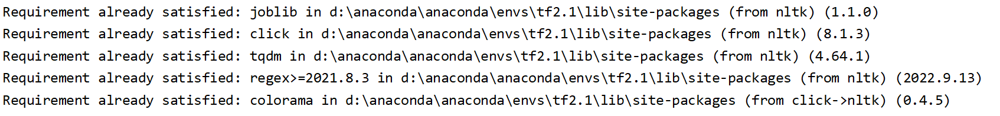
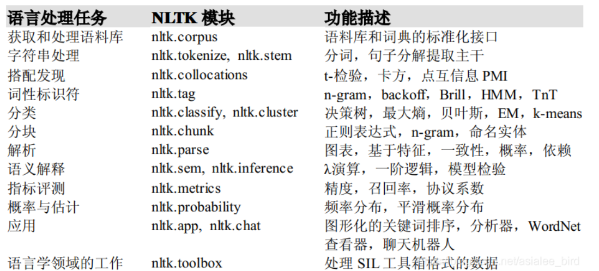

# NLTK
2201210498 尹雯婧
## 1. NLTK安装及用途
### (1) NLTK简介
NLTK，全称Natural Language Toolkit，自然语言处理工具包，是NLP研究领域常用的一个Python库，由宾夕法尼亚大学的Steven Bird和Edward Loper在Python的基础上开发的一个模块，至今已有超过十万行的代码。这是一个开源项目，包含数据集、Python模块、教程等。
### (2) NLTK安装
打开终端进行nltk安装
```text
pip install nltk
```
成功安装


打开终端依次输入以下内容来安装NLTK包
```text
>python
>>>import nltk
>>>nltk.download()
```

### (3) NLTK常见模块及用途

### (4) NLTK自带的语料库corpus
nltk.corpus包提供了几类标注好的语料库：

|语料库|       说明       |
| :-------- | :----------- |
|gutenberg| 一个有若干万部的小说语料库，多是古典作品|
|webtext|收集的网络广告等内容|
|nps_chat|有上万条聊天消息语料库，即时聊天消息为主|
|brown|一个百万词级的英语语料库，按文体进行分类|
|reuters|路透社语料库，上万篇新闻方档，约有1百万字，<br>分90个主题，并分为训练集和测试集两组|
|inaugural|演讲语料库，几十个文本，都是总统演说|
```python
from nltk.corpus import brown
print(brown.categories())   #输出brown语料库的类别
print(len(brown.sents()))   #输出brown语料库的句子数量
print(len(brown.words()))   #输出brown语料库的词数量

'''
结果为：
['adventure', 'belles_lettres', 'editorial', 'fiction', 'government', 'hobbies', 
'humor', 'learned', 'lore', 'mystery', 'news', 'religion', 'reviews', 'romance', 
'science_fiction']
57340
1161192
'''
```
## 2. NLTK词频统计
NLTK 中的FreqDist() 类主要记录每个词出现的次数，根据统计数据生成表格或绘图。

|方法|作用|
|:---|:---|
|B()|	返回词典的长度|
|plot(title,cumulative=False)|	绘制频率分布图，若cumu为True，则是累积频率分布图|
|tabulate()|	生成频率分布的表格形式|
|most_common()|	返回出现次数最频繁的词与频度|
|hapaxes()|	返回只出现过一次的词|
其实现如下：
```python
import nltk
tokens = ['day', 'to', 'night', 'to', 'morning', 'keep', 'with',
          'me', 'in', 'the', 'moment', 'I\'d', 'let', 'you', 'had',
          'I', 'known', 'it', 'why', 'don\'t', 'you', 'say', 'so']
# 统计词频
freq = nltk.FreqDist(tokens)

# 输出词和相应的频率
for key, val in freq.items():
    print(str(key) + ':' + str(val))

# 可以把最常用的5个单词拿出来
standard_freq = freq.most_common(5)
print(standard_freq)
```
运行结果如下：
```text
day:1
to:2
night:1
morning:1
keep:1
with:1
me:1
in:1
the:1
moment:1
I'd:1
let:1
you:2
had:1
I:1
known:1
it:1
why:1
don't:1
say:1
so:1
[('to', 2), ('you', 2), ('day', 1), ('night', 1), ('morning', 1)]
```
## 3. NLTK去除停用词 (stopwords)
```python
from nltk.corpus import stopwords
stwords = stopwords.words('english')
print(stwords) # 打印英文停用词表
```
英文停用词表如下：<br>
['i', 'me', 'my', 'myself', 'we', 'our', 'ours', 'ourselves', 'you', "you're", "you've", "you'll", "you'd", 'your', 'yours', 'yourself', 'yourselves', 'he', 'him', 'his', 'himself', 'she', "she's", 'her', 'hers', 'herself', 'it', "it's", 'its', 'itself', 'they', 'them', 'their', 'theirs', 'themselves', 'what', 'which', 'who', 'whom', 'this', 'that', "that'll", 'these', 'those', 'am', 'is', 'are', 'was', 'were', 'be', 'been', 'being', 'have', 'has', 'had', 'having', 'do', 'does', 'did', 'doing', 'a', 'an', 'the', 'and', 'but', 'if', 'or', 'because', 'as', 'until', 'while', 'of', 'at', 'by', 'for', 'with', 'about', 'against', 'between', 'into', 'through', 'during', 'before', 'after', 'above', 'below', 'to', 'from', 'up', 'down', 'in', 'out', 'on', 'off', 'over', 'under', 'again', 'further', 'then', 'once', 'here', 'there', 'when', 'where', 'why', 'how', 'all', 'any', 'both', 'each', 'few', 'more', 'most', 'other', 'some', 'such', 'no', 'nor', 'not', 'only', 'own', 'same', 'so', 'than', 'too', 'very', 's', 't', 'can', 'will', 'just', 'don', "don't", 'should', "should've", 'now', 'd', 'll', 'm', 'o', 're', 've', 'y', 'ain', 'aren', "aren't", 'couldn', "couldn't", 'didn', "didn't", 'doesn', "doesn't", 'hadn', "hadn't", 'hasn', "hasn't", 'haven', "haven't", 'isn', "isn't", 'ma', 'mightn', "mightn't", 'mustn', "mustn't", 'needn', "needn't", 'shan', "shan't", 'shouldn', "shouldn't", 'wasn', "wasn't", 'weren', "weren't", 'won', "won't", 'wouldn', "wouldn't"]
<br>

运行以下代码进行停用词清洗：
```python
from nltk.corpus import stopwords

tokens = ['day', 'to', 'night', 'to', 'morning', 'keep', 'with',
          'me', 'in', 'the', 'moment', 'I\'d', 'let', 'you', 'had',
          'I', 'known', 'it', 'why', 'don\'t', 'you', 'say', 'so']

clean_tokens = tokens[:]
stwords = stopwords.words('english')
for token in tokens:
    if token in stwords:
        clean_tokens.remove(token)

print(clean_tokens)
```
运行结果如下：
```text
['day', 'night', 'morning', 'keep', 'moment', "I'd", 'let', 'I', 'known', 'say']
```
## 4. NLTK分词&分句 (tokenize)
### (1) 对英文文本进行分句
```python
from nltk.tokenize import sent_tokenize
mytext = "Day to night to morning, keep with me in the moment. I'd let you had I known it. Why don't you say so?"
print(sent_tokenize(mytext))
```
分句结果如下：
```text
['Day to night to morning, keep with me in the moment.', "I'd let you had I known it.", "Why don't you say so?"]
```
### (2) 对英文文本进行分词
```python
from nltk.tokenize import word_tokenize
mytext = "Day to night to morning, keep with me in the moment. I'd let you had I known it. Why don't you say so?"
print(word_tokenize(mytext))
```
分词结果如下：
```text
['Day', 'to', 'night', 'to', 'morning', ',', 'keep', 'with', 'me', 'in', 'the', 'moment', '.', 
'I', "'d", 'let', 'you', 'had', 'I', 'known', 'it', '.', 'Why', 'do', "n't", 'you', 'say', 'so', '?']
```
### (3) 对非英文文本进行分句
```python
from nltk.tokenize import sent_tokenize
mytext = "Del día a la noche a la mañana, mantente conmigo en el momento. " \
         "Te dejaría si lo supiera. ¿Por qué no lo dices?"
print(sent_tokenize(mytext, language='spanish'))  # 设定语言为西班牙语
```
分句结果如下：
```text
['Del día a la noche a la mañana, mantente conmigo en el momento.', 'Te dejaría si lo supiera.', '¿Por qué no lo dices?']
```
## 5. NLTK词干提取 (Stemming)
词干提取最常用的办法就是 Porter 提取算法。NLTK中有一个PorterStemmer类，使用的就是Porter提取算法。

举例来说，gets的词干是get。搜索引擎索引页面经常使用这种技术。效果就是，输入同一个单词的不同形式，返回的用于进行检索的值都是相同的。
### (1) PorterStemmer
```python
from nltk.stem import PorterStemmer
porter_stemmer = PorterStemmer()
print(porter_stemmer.stem('gets'))
```
运行结果为：
```text
get
```
### (2) LancasterStemmer
```python
from nltk.stem import LancasterStemmer
lancaster_stemmer = LancasterStemmer()
print(lancaster_stemmer.stem('gets'))  #结果应该为：get
```
运行结果为：
```text
get
```
### (3) SnowballStemmer 提取非英语单词词干
NLTK的SnowballStemmer类除了英语外，还适用于其他13种语言：
```python
from nltk.stem import SnowballStemmer
print(SnowballStemmer.languages)
```
运行结果为：
```text
('arabic', 'danish', 'dutch', 'english', 'finnish', 'french', 'german', 'hungarian', 'italian', 'norwegian', 'porter', 
'portuguese', 'romanian', 'russian', 'spanish', 'swedish')
```
使用SnowballStemmer类中的stem()函数来提取非英语单词：
```python
from nltk.stem import SnowballStemmer
french_stemmer = SnowballStemmer('french')
print(french_stemmer.stem("Jour après jour, nuit après matin, reste avec moi dans l'instant. "
                          "Je te laisserais faire si je le savais. Pourquoi ne pas le dire ?"))
```
运行结果为：
```text
jour après jour, nuit après matin, reste avec moi dans l'instant. 
je te laisserais faire si je le savais. pourquoi ne pas le dire ?
```
## 6. NLTK词形还原 (Lemmatization)
### (1)
词干提取经常会出现意想不到的问题，返回一个本来并不存在的单词。
```python
from nltk.stem import PorterStemmer
porter_stemmer = PorterStemmer()
print(porter_stemmer.stem('increases'))
```
比如在提取increases这个词的词干的时候，提取结果为：
```text
increas
```
而词性还原的结果为一个真正的词。
```python
from nltk.stem import WordNetLemmatizer
lemmatizer = WordNetLemmatizer()
print(lemmatizer.lemmatize('increases'))  # 结果为：increase
```
运行结果为：
```text
increase
```
### (2)
我们运行以下代码：
```text
from nltk.stem import WordNetLemmatizer
lemmatizer = WordNetLemmatizer()
print(lemmatizer.lemmatize('getting'))
```
运行结果为：
```text
getting
```
并没有返回get的原因是，lemmatize()方法默认返回的词性是名词，如果我们想返回动词，可以通过以下方法进行指定。
```text
from nltk.stem import WordNetLemmatizer
lemmatizer = WordNetLemmatizer()
print(lemmatizer.lemmatize('getting', pos="v"))
```
运行结果为：
```text
get
```
lemmatize()方法其实是用到了WordNet所以才会准确返回真实存在的单词。  
关于WordNet的使用会在后文进行介绍。
### (3)
lemmatize()方法返回的结果可以是动词(v)、名词(n)、形容词(a)、副词(r)。使用方法如下。
```python
from nltk.stem import WordNetLemmatizer
lemmatizer = WordNetLemmatizer()
print(lemmatizer.lemmatize('alleged', pos="v"))  # 返回动词
print(lemmatizer.lemmatize('friends', pos="n"))  # 返回名词
print(lemmatizer.lemmatize('previous', pos="a"))  # 返回形容词
print(lemmatizer.lemmatize('carelessly', pos="r"))  # 返回副词
```
运行结果为：
```text
allege
friend
previous
carelessly
```
词形还原方法将单词还原成原形形式，可以很有效地压缩文本量。
## 7. NLTK词性标注(POS Tag)
词性标注可以将一个句子中的单词标注为动词、名词、形容词以及副词等。
```python
import nltk
text=nltk.word_tokenize('why don\'t you say so?')
print(text)
print(nltk.pos_tag(text))
```
运行结果为：
```text
['why', 'do', "n't", 'you', 'say', 'so', '?']
[('why', 'WRB'), ('do', 'VBP'), ("n't", 'RB'), ('you', 'PRP'), ('say', 'VBP'), ('so', 'RB'), ('?', '.')]
```
这其中出现的词性标注(Part of Speech)为：

|标记(Tag)|含义(Meaning)|例子(Examples)|
|----|-----|-----|
|PRP|Personal Pronoun 人称代词|I, you, he|
|RB|Adverb 副词|so, greatly|
|VBP|Verb, non-3rd present 动词（非第三人称现在时）|do, say, go|
|WRB|Wh-adverb Wh开头的副词|when, where, why|
|.|Sentence-final punctuation 句尾标点|. ? !|

pos_tag()方法厉害的地方在于可以根据上下文和句意判断具有多种词性的词在特定的句子或者短语当中分别是什么词性。
```python
import nltk
text1=nltk.word_tokenize('cut with a saw')
text2=nltk.word_tokenize('I saw him yesterday.')
print(nltk.pos_tag(text1))
print(nltk.pos_tag(text2))
```
运行结果为：
```text
[('cut', 'NN'), ('with', 'IN'), ('a', 'DT'), ('saw', 'NN')]
[('I', 'PRP'), ('saw', 'VBD'), ('him', 'PRP'), ('yesterday', 'NN'), ('.', '.')]
```
这两句中saw的词性分别为名词和动词，可以看到给出的结果中，pos_tag()方法成功准确标注了两种不同的词性。
## 8. NLTK中的WordNet
WordNet是一个词与词之间存在各种关系的词典，不同于传统词典和同义词词典，WordNet有是以同义词集合(Synset)作为基本的构建单位来组织的，用户可以在同义词集合中找到一个合适的词去表达一个已知的概念。与传统词典类似，它也给出了指定词的定义和例句。

WordNet把同义词集合以一定的关系类型联系起来，其中有同义关系(synonymy)、反义关系(antonymy)、上下位关系(hypernymy/hyponymy)、整体和部分关系(meronymy)和继承关系(entailment)等。

在传统词典中的词条是多义词，会有多个解释。但在WordNet中，大多数的同义词集都有说明性的注释，但一个Synset不等于词典中的一个词条，因为一个Synset只包含一个注释。即“一个Synset等于一个词义”，以一条词义为一条数据。

### (1) synsets结构
```python
from nltk.corpus import wordnet
syn = wordnet.synsets("fast")
print(syn)
```
运行结果为：
```text
[Synset('fast.n.01'), Synset('fast.v.01'), Synset('fast.v.02'), Synset('fast.a.01'), Synset('fast.a.02'), 
Synset('fast.a.03'), Synset('fast.s.04'), Synset('fast.s.05'), Synset('debauched.s.01'), Synset('flying.s.02'), 
Synset('fast.s.08'), Synset('firm.s.10'), Synset('fast.s.10'), Synset('fast.r.01'), Synset('fast.r.02')]
```
### (2) 获取定义和例句
注意也需要进行pos指定，否则默认为动词：
```python
from nltk.corpus import wordnet
syn = wordnet.synsets("fast")  #获取"fast"的同义词集
print(syn[0].definition())
print(syn[0].examples())
```
运行结果为：
```text
abstaining from food
[]
```
fast的动词释义为“禁食”，这里在没有指定pos的情况下，默认返回了fast的动词词义。  
将pos指定为形容词(a)之后：
```python
from nltk.corpus import wordnet
syn = wordnet.synsets("fast", pos='a')  #获取"fast"的同义词集
print(syn[0].definition())
print(syn[0].examples())
```
运行结果为：
```text
acting or moving or capable of acting or moving quickly
['fast film', 'on the fast track in school', 'set a fast pace', 'a fast car']
```
### (3) 获取同义词
```python
from nltk.corpus import wordnet
synonyms = []
for syn in wordnet.synsets('fancy', pos='v'):  # 同义词
    for lemma in syn.lemmas():  # 词元
        synonyms.append(lemma.name())
print(synonyms)
```
运行结果为：
```text
['visualize', 'visualise', 'envision', 'project', 'fancy', 'see', 'figure', 'picture', 'image', 'fancy', 'go_for', 'take_to']
```
### (4) 获取反义词
WordNet中每一个单词是有其对应的反义词的，我们可以用“返回该词所有同义词的反义词”这种方法还获取该词的反义词。
```python
from nltk.corpus import wordnet
antonyms = []
for syn in wordnet.synsets("fast"):  # 同义词
    for lemma in syn.lemmas():
        if lemma.antonyms() and lemma.antonyms()[0].name() not in antonyms:   # 如果其同义词有反义词且不在antonyms里面
            antonyms.append(lemma.antonyms()[0].name())  # 将这个同义词的反义词放入antonyms
print(antonyms)
```
运行结果为：
```text
['slow']
```

#### 参考资料：
[NLTK Corpora](http://www.nltk.org/nltk_data/)  
[Natural Language Toolkit](https://www.nltk.org/)  
[NLTK使用方法总结](https://blog.csdn.net/asialee_bird/article/details/85936784?ops_request_misc=%257B%2522request%255Fid%2522%253A%2522166588929716800186587045%2522%252C%2522scm%2522%253A%252220140713.130102334..%2522%257D&request_id=166588929716800186587045&biz_id=0&utm_medium=distribute.pc_search_result.none-task-blog-2~all~top_positive~default-1-85936784-null-null.142^v56^control_1,201^v3^add_ask&utm_term=NLTK&spm=1018.2226.3001.4187)  
[WordNet用法及思路](https://zhuanlan.zhihu.com/p/26527203)
